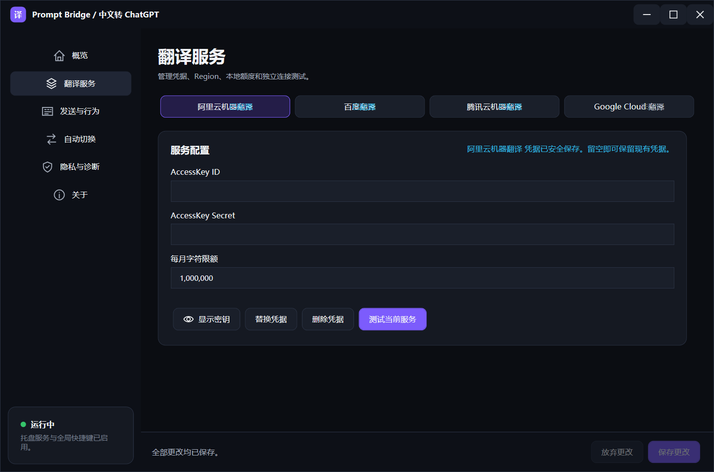

# Prompt Bridge

<p align="center">
  <strong>简体中文</strong> · <a href="README.en.md">English</a>
</p>

<p align="center">
  <strong>在 AI 桌面客户端中用中文思考，用英文提示词发送。</strong>
</p>

Prompt Bridge 是一款 Windows 托盘工具。把光标放在受支持的 AI 桌面客户端输入框中，输入中文并按下 `Ctrl+Shift+Enter`，程序会将可翻译内容转换为英文、追加：

> Please reply in Chinese.

然后根据你的设置立即发送，或停留在输入框中供你预览。



## 功能亮点

- 支持 ChatGPT for Windows、Claude Desktop / Claude Code 视图与 Antigravity 2.0。
- 支持 Google、阿里云、百度和腾讯云机器翻译。
- 支持自动故障切换、固定服务商和可调整的优先级顺序。
- 根据本地月度字符限额自动跳过已耗尽的服务商。
- 保护代码块、行内代码、URL、邮箱、Markdown 链接目标、文件路径与常见命令行。
- 支持立即发送和发送前预览两种模式。
- 中文与英文双语界面，深色专业控制台。
- 凭据保存在 Windows Credential Manager，不写入设置文件或日志。
- 写入后严格验证；失败时回滚原始草稿，并且绝不静默发送未翻译内容。

## 系统要求

- Windows 10/11 x64
- ChatGPT、Claude Desktop 或 Antigravity 2.0 桌面客户端之一
- 至少一个受支持翻译服务商的 API 凭据

使用 Releases 中的自包含版本时，不需要另外安装 .NET Runtime。

## 快速开始

1. 从 GitHub Releases 下载最新的 `PromptBridge-*-win-x64.zip`。
2. 解压后运行 `ChineseToChatGPT.exe`。
3. 在首次设置中选择翻译服务商，输入 API 凭据并执行连接测试。
4. 打开受支持的 AI 客户端并聚焦消息输入框。
5. 输入中文，按下 `Ctrl+Shift+Enter`。

程序默认使用立即发送模式。你也可以在“发送与行为”中切换到预览模式：第一次按快捷键完成翻译，第二次在内容未变化时发送。

## 支持的翻译服务

| 服务商 | 凭据 | 默认本地月度上限 |
|---|---|---:|
| 阿里云机器翻译 | AccessKey ID / AccessKey Secret | 1,000,000 字符 |
| 百度翻译 | APPID / Secret Key | 50,000 字符 |
| 腾讯云机器翻译 | SecretId / SecretKey / Region | 5,000,000 字符 |
| Google Cloud Translation Basic v2 | API Key | 500,000 字符 |

默认自动切换顺序为阿里云、百度、腾讯云、Google。只有已经配置凭据的服务商会参与自动切换。所有额度都是本地安全上限，不代表服务商账户的真实剩余额度；如果你还在其他设备或应用中使用相同凭据，请自行预留余量。

## 安全机制

Prompt Bridge 采用事务式流程：

1. 读取原始草稿，但不修改输入框。
2. 分割并保护技术内容。
3. 调用翻译服务并重新组装文本。
4. 写入最终英文消息。
5. 通过 UI Automation 或剪贴板回退路径重新读取并验证。
6. 仅在内容、窗口和焦点全部验证通过后发送。
7. 任一环节失败时恢复原始草稿；无法确认恢复时显示高优先级警告，仍然不会发送。

剪贴板回退会暂存并恢复可访问的剪贴板格式。日志不会记录草稿、译文、剪贴板内容、凭据、签名、Authorization Header、请求正文或完整请求 URL。

## 支持的客户端

| 客户端 | 进程 | 支持情况 |
|---|---|---|
| ChatGPT for Windows | `ChatGPT.exe` | 支持 |
| Claude Desktop / Claude Code 视图 | `Claude.exe` | 支持 |
| Antigravity 2.0 | `Antigravity.exe` | 支持 |
| 浏览器版本 | — | 暂不支持 |
| macOS | — | 暂不支持 |

程序只在受支持的前台进程及可编辑消息输入框获得焦点时响应快捷键。普通 Enter 和客户端自带的发送按钮不受影响。

## 隐私

- API 凭据：保存到 Windows Credential Manager。
- 非敏感设置：保存到 `%LocalAppData%\ChineseToChatGPT`。
- 诊断信息：仅包含时间、服务商、操作类型、错误分类/代码、HTTP 状态、耗时和字符数。
- 翻译内容：只发送给当前选中的翻译服务商。
- 最终提示词：只写入当前受支持客户端的输入框。

## 从源码构建

要求安装 [.NET 8 SDK](https://dotnet.microsoft.com/download/dotnet/8.0)。

```powershell
dotnet restore ChineseToChatGPT.sln
dotnet build ChineseToChatGPT.sln -c Release --no-restore
dotnet run --project tests\ChineseToChatGPT.Tests\ChineseToChatGPT.Tests.csproj -c Release --no-build
```

生成 Windows x64 自包含单文件版本：

```powershell
dotnet publish src\ChineseToChatGPT.App\ChineseToChatGPT.App.csproj `
  -c Release -r win-x64 --self-contained true `
  -p:PublishSingleFile=true `
  -p:IncludeNativeLibrariesForSelfExtract=true `
  -o publish
```

测试程序不依赖第三方测试框架，也不会连接任何翻译服务商。

## 项目结构

```text
src/
  ChineseToChatGPT.App/    WPF、托盘、Windows UI Automation 与凭据存储
  ChineseToChatGPT.Core/   翻译服务、文本保护、自动切换与事务工作流
tests/
  ChineseToChatGPT.Tests/  无外部框架的单元与集成测试
.github/workflows/         持续集成与发布流程
```

## 已知限制

- 桌面客户端更新可能改变其可访问性结构；识别或验证失败时程序会安全停止。
- 当前可执行文件没有代码签名，Windows SmartScreen 可能显示警告。
- 腾讯云适配器使用项目中现有的 TMT 调用路径；如果账户不再支持对应操作，自动模式会安全切换到下一家服务商。
- 本项目不会拦截普通 Enter、鼠标点击发送或浏览器输入框。

## 参与贡献与安全问题

- 提交代码前请阅读 [CONTRIBUTING.md](CONTRIBUTING.md)。
- 安全漏洞或可能泄露提示词/凭据的问题请按照 [SECURITY.md](SECURITY.md) 私下报告，不要公开提交 Issue。
- 版本变化记录见 [CHANGELOG.md](CHANGELOG.md)。

## 免责声明

本项目与 OpenAI、Anthropic、Google、阿里云、百度、腾讯云或 Antigravity 没有官方隶属关系。使用第三方翻译 API 可能产生费用，请自行管理账户权限、额度与账单。

## 许可证

本项目采用 [MIT License](LICENSE)。
